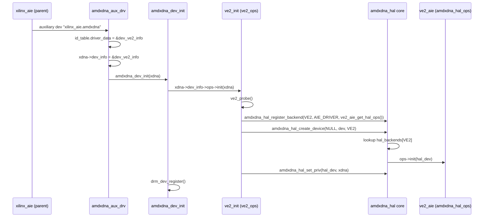

# AMDXDNA driver layering — team overview

**Audience:** firmware, runtime, and kernel engineers on `amdxdna` (PCI AIE2/AIE4 and auxiliary-bus VE2).

**Purpose:** Explain how the **core DRM driver**, **HAL dispatcher**, **firmware backends**, and **platform drivers** fit together — including **registration** at probe time and **DT-driven** selection of the VE2 HAL backend (`ve2_aie` today).

---

## 1. Correct mental model (three tiers)

```
┌─────────────────────────────────────────────────────────────────┐
│  IOCTL / GEM / scheduler  (amdxdna_ctx.c, amdxdna_gem.c, …)      │
│  “Core amdxdna driver” — uABI, memory, hwctx objects             │
└────────────────────────────┬────────────────────────────────────┘
                             │ amdxdna_dev_ops (per platform)
┌────────────────────────────▼────────────────────────────────────┐
│  Platform driver: VE2 (ve2_aux.c, ve2_hwctx.c, ve2_hq.c)         │
│  • XRS, DRM hwctx, cert/CMA probe, host queue command path       │
│  • Selects + registers HAL backend, owns hal_dev per DRM device  │
└────────────────────────────┬────────────────────────────────────┘
                             │ amdxdna_hal_create_hwctx(), submit_job, …
┌────────────────────────────▼────────────────────────────────────┐
│  HAL core (amdxdna_hal.c) — dispatcher only                      │
│  • Backend registry (per platform_id)                            │
│  • Per-device hal_dev instance                                   │
└────────────────────────────┬────────────────────────────────────┘
                             │ hal_dev->ops->*
┌────────────────────────────▼────────────────────────────────────┐
│  Firmware backend (pluggable, one active per device)               │
│  • ve2_aie.c      → Linux xlnx-aie (aie_partition_*)             │
│  • (future) separate HAL backend modules per FW path (e.g. mailbox) │
│  • aie2_hal_message.c → (future) AIE2 PCI message protocol       │
└────────────────────────────┬────────────────────────────────────┘
                             │
                             ▼
                      Firmware / AIE hardware
```

**Important:** All of the above ships in **one kernel module** (`amdxdna.ko`) today. “Registration” means **function-pointer tables and probe-time setup**, not loading separate kernel modules (unless you choose that model later).

---

## 2. Three registration mechanisms (not three drivers)

| # | What | How it binds | Key symbols |
|---|------|----------------|-------------|
| **A** | Core ↔ VE2 **platform** | Auxiliary (or PCI) ID table → `amdxdna_dev_info` | `amdxdna_aux_drv.c`, `dev_ve2_info`, `ve2_ops` |
| **B** | HAL core ↔ **firmware backend** | `amdxdna_hal_register_backend()` | `amdxdna_hal.c`, `ve2_aie_get_hal_ops()` |
| **C** | Per-GPU **HAL device instance** | `amdxdna_hal_create_device()` | `xdna_hdl->hal_dev` in `ve2_aux.c` |

`ve2_aie` is **not** a bus driver. It exports `struct amdxdna_hal_ops`; the platform (`ve2_init`) registers that table with the HAL core.

---

## 3. Probe-time registration flow (VE2)

### 3.1 Sequence



### 3.2 Step A — Platform registers with core (aux table)

`amdxdna_aux_drv.c` matches the auxiliary device name and stores the platform descriptor:

```c
{ .name = "xilinx_aie.amdxdna",      .driver_data = (kernel_ulong_t)&dev_ve2_info_aie },
```

On probe: `xdna->dev_info = (struct amdxdna_dev_info *)id->driver_data`.

Each `dev_ve2_info_*` row (`ve2_aux.c`) embeds the firmware interface in `dev_priv`:

```c
const struct amdxdna_dev_info dev_ve2_info_aie = {
	.device_type = AMDXDNA_DEV_TYPE_KMQ,
	.dev_priv    = &ve2_aux_priv_aie,   /* .fw_interface = VE2_FW_INTERFACE_AIE */
	.ops         = &ve2_ops,
};
```

After this, IOCTL paths use `xdna->dev_info->ops` → **`ve2_ops`** (`hwctx_init`, `cmd_submit`, …).

### 3.3 Step B — Firmware backend registers with HAL core

Inside **`ve2_init()`** (platform), backend is chosen from the aux-matched `dev_priv` **before** `ve2_probe()`:

```c
fw_iface = priv->fw_interface;   /* from dev_ve2_info_aie or dev_ve2_info_mbox */
hal_ops = ve2_hal_ops_for_interface(fw_iface, &impl_type);
/* then ve2_probe(), register_backend, create_device, set_priv */
```

- **`ve2_hal_ops_for_interface`** — maps `VE2_FW_INTERFACE_*` to `ve2_aie_get_hal_ops()` (mailbox → `NULL` / probe `-ENODEV`).
- **`register_backend`** — stores the selected ops table in `hal_backends[AMDXDNA_PLATFORM_VE2]` (global table, mutex-protected).
- **`create_device(NULL, …)`** — HAL looks up that ops pointer, allocates **`hal_dev`**, calls `ops->init(hal_dev)`.
- **`set_priv`** — backends use `amdxdna_hal_get_priv(hal_dev)` to reach `struct amdxdna_dev` / `amdxdna_dev_hdl`.

Teardown (`ve2_fini`): `amdxdna_hal_destroy_device()` → `amdxdna_hal_unregister_backend(VE2)`.

### 3.4 Runtime hwctx create (after registration)

Registration happens **once at probe**. Creating a hwctx is **per client context**:

```
DRM_IOCTL_AMDXDNA_CREATE_HWCTX
  → amdxdna_drm_create_hwctx_ioctl()          [core]
  → xdna->dev_info->ops->hwctx_init()         [ve2_ops → ve2_hwctx_layer1_init]
  → amdxdna_hal_create_hwctx(hdl->hal_dev, …) [HAL core]
  → partition_create + context_create         [ve2_aie.c → aie_partition_*]
```

`CONFIG_HWCTX` IOCTL → **`ve2_hwctx_config()`** (`dev_ops`), not HAL, unless the platform adds an explicit bridge.

---

## 4. Is HAL binding “static”? (clarification)

| Aspect | Today | Typical goal |
|--------|--------|----------------|
| **Which backend for VE2** | **`ve2_hal_ops_for_interface()`** from aux-matched `dev_priv` | Chosen by aux device name |
| **When backend is registered** | During `ve2_init` at device probe | Still at probe for that device (not per-hwctx) |
| **HAL core lifetime** | Linked in `amdxdna.ko`; registry is a static table | Optional `amdxdna_hal_init()` at module load |
| **Separate .ko for ve2_aie** | No — same module | Optional later |

Your intuition is **half right**:

- **HAL core** *should* be ready before any backend registers (table + mutex). Today the table is implicit zero-init; there is no explicit `amdxdna_hal_init()` yet.
- **Backends** register at **device probe** (or module init if split into submodules) — not on every hwctx create.
- **Selection** of the VE2 HAL backend is a **policy decision in the platform layer** (`ve2_init` reads `dev_priv->fw_interface` from the aux ID table), not in the HAL dispatcher itself.

The HAL only dispatches whatever was registered for `AMDXDNA_PLATFORM_VE2` (today always `ve2_aie`).

---

## 5. Choosing the VE2 HAL backend (device tree)

You will only ever have **one active firmware backend per DRM device**. The registry today allows **one ops table per `platform_id`** (`-EBUSY` if registered twice).

Recommended responsibility split:

```
┌──────────────────────────────────────────────────────────────┐
│  Policy: WHICH backend?  (aux ID → dev_ve2_info_* / dev_priv)   │
└────────────────────────────┬─────────────────────────────────┘
                             │ register exactly one ops table
┌────────────────────────────▼─────────────────────────────────┐
│  HAL core: dispatch HOW?  (create_hwctx, submit_job, …)       │
└────────────────────────────┬─────────────────────────────────┘
                             │
              ▼
        ve2_aie.c  (only backend in tree today)
     aie_partition_*
```

### 5.1 Device tree / firmware selection (not used)

DT property `amd,xdna-fw-interface` is **not** consulted. The parent AIE driver must register the correct auxiliary device name (§5.2).

### 5.2 `dev_ve2_info` / multiple aux ID entries (**implemented**)

Two auxiliary names → two `amdxdna_dev_info` rows (`amdxdna_aux_drv.c`):

| Aux device name | `driver_data` | `dev_priv.fw_interface` | Result |
|-----------------|---------------|-------------------------|--------|
| `xilinx_aie.amdxdna` | `&dev_ve2_info_aie` | `VE2_FW_INTERFACE_AIE` | Probe continues (`ve2_aie`) |
| `xilinx_aie.amdxdna_mbox` | `&dev_ve2_info_mbox` | `VE2_FW_INTERFACE_MAILBOX` | **Probe fails** (`-ENODEV`; no mailbox HAL in tree) |

The parent/firmware stack creates exactly one of these auxiliary devices per board.

**Pros:** Explicit, no DT parsing. **Cons:** Two aux names to maintain in the AIE parent driver.

### 5.3 Option 3 — Module parameter (bring-up / debug)

```c
static char *ve2_fw_backend = "aie";
module_param(ve2_fw_backend, charp, 0644);
```

**Pros:** Quick lab testing. **Cons:** Global, not per-device — avoid for production.

### 5.4 Option 4 — Extend `struct amdxdna_dev_info`

```c
struct amdxdna_dev_info {
	...
	enum ve2_fw_backend_type fw_backend;  /* or const struct amdxdna_hal_ops *hal_ops */
};
```

Different `dev_ve2_info` instances for different SKUs, still one aux table entry per SKU.

### 5.5 Option 5 — Separate kernel modules (advanced)

- `amdxdna.ko` — core + HAL + platform shell.
- `amdxdna_ve2_aie.ko` — `module_init` → `amdxdna_hal_register_backend(VE2, …)`.
- `amdxdna_ve2_mailbox.ko` — same, different ops (only one loaded).

`ve2_init` only calls `amdxdna_hal_create_device()` and fails if no backend registered.

**Pros:** True plug-in, smaller images. **Cons:** Module ordering, symbol exports, more packaging complexity.

### 5.6 Suggested evolution of HAL registry (if you need multiple backends compiled in)

Today:

```c
hal_backends[AMDXDNA_PLATFORM_VE2].ops = ve2_aie_get_hal_ops();  /* single slot */
```

Optional future API:

```c
/* Register all implementations at module init (no device yet) */
amdxdna_hal_register_impl(AMDXDNA_PLATFORM_VE2, "aie", ve2_aie_get_hal_ops());
amdxdna_hal_register_impl(AMDXDNA_PLATFORM_VE2, "mailbox", ve2_mailbox_get_hal_ops());

/* Per device probe */
ops = amdxdna_hal_resolve_backend(AMDXDNA_PLATFORM_VE2, "aie");  /* from DT */
amdxdna_hal_register_backend(AMDXDNA_PLATFORM_VE2, …, ops);       /* bind one */
```

Plus at module load:

```c
static int __init amdxdna_hal_module_init(void)
{
	memset(hal_backends, 0, sizeof(hal_backends));
	/* optional: register impl catalog */
	return 0;
}
subsys_initcall(amdxdna_hal_module_init);
```

This matches the mental model: **HAL core ready first**, **platform picks implementation at probe**, **HAL device instance per DRM dev**.

### 5.7 What not to do

- Do **not** register two backends for the same `platform_id` without replacing the first (current code returns `-EBUSY`).
- Do **not** select backend per hwctx — backend is per **device**; hwctxs share the same `hal_dev->ops`.

---

## 6. Comparison with AIE2 (PCI)

| Step | VE2 (AUX) | AIE2 (PCI) |
|------|-----------|------------|
| Attach | `amdxdna_aux_id_table` → `dev_ve2_info` | PCI ID → `dev_npu*_info` |
| Platform init | `ve2_ops.init` | `aie2_pci` init path |
| Backend | `ve2_aie` (via aux → `dev_ve2_info_aie`) | `aie2_message` via HAL (future) |
| HAL bind | `register_backend(VE2, …)` | `register_backend(AIE2, MSGPROTO, …)` |

Same HAL surface; different **platform** attach and **backend** implementation.

---

## 7. File roles (VE2 tree)

| File | Role |
|------|------|
| `amdxdna_hal.c` / `.h` | HAL dispatcher, backend registry, `create_hwctx` / `destroy_hwctx` |
| **`ve2_aie.c` / `ve2_aie.h`** | Firmware backend — `aie_partition_*`, handshake, jobs |
| **`ve2_hal_backend.c`** | `ve2_hal_ops_for_interface()` — maps `dev_priv.fw_interface` to `ve2_aie` |
| `ve2_aux.c` | `dev_ve2_info_aie`, `ve2_probe` (cert/CMA/XRS), `ve2_init` + `register_backend` |
| `ve2_hwctx.c` | DRM hwctx: XRS, host queue, `amdxdna_hal_create_hwctx` |
| `ve2_hq.c` | Host queue ERT submit/wait → `ve2_aie_kick_cmd` |
| `ve2_handshake.h` | FW handshake layout (ABI) |

---

## 8. VE2 call stack (aligned with HAL proposal v2)

| Stage | Files | Responsibility |
|-------|--------|----------------|
| **Platform** | `ve2_aux.c`, `ve2_hwctx.c`, `ve2_hq.c` | DRM ops, probe, XRS, HSA queue |
| **HAL backend** | `ve2_aie.c` | `amdxdna_hal_ops` — direct `aie_partition_*`, scheduler, handshake |

All xilinx-aie driver access is confined to **`ve2_aie.c`** (and cert broadcast during **`ve2_probe`** in `ve2_aux.c`).

---

## 9. Glossary

| Term | Meaning |
|------|---------|
| **HAL core** | `amdxdna_hal.c` — dispatch + registry + per-device `hal_dev` |
| **HAL backend** | `ve2_aie.c`, … — implements `amdxdna_hal_ops` |
| **Platform driver** | `ve2_*` via `amdxdna_dev_ops` — DRM-facing, **chooses backend** |
| **`register_backend`** | Publish one `amdxdna_hal_ops` for a `platform_id` before `create_device` |
| **`hal_dev`** | Per DRM device HAL instance (holds ops pointer + priv) |

---

*Version 3.4 — HAL proposal v2 ops; `ve2_hw` removed; AIE backend in `ve2_aie.c` only.*
